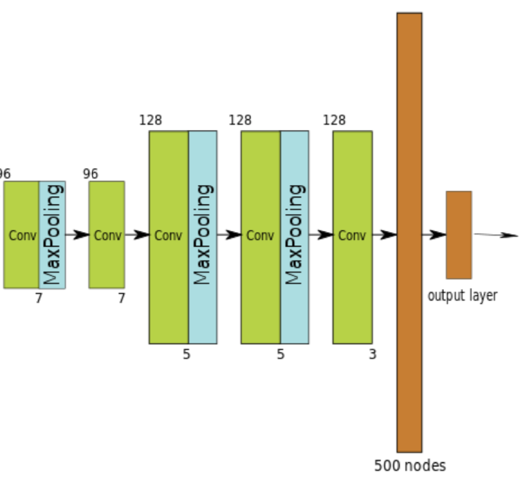
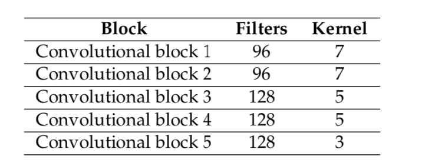

# AXD3DLocalizer

## Localisation latérale de flux audios binauraux en temps réel

### Problématiques et contraintes :

Ce projet de recherche visait à répondre à un besoin d'un indicateur fiable en temps réel des attributs spatiaux des signaux audio binauraux ; en d'autres termes, d'un outil permettant la localisation dans l'espace de la source enregistrée d'une piste son 3D tel que le ferait le cerveau humain.

### Démarche de recherche :

Nous avons tout d'abord fait un tour d'horizon de l'état de l'art en matière de localisation de flux audios binauraux. Trois approches distinctes s'en détachent :

La première approche cherche à prédire la localisation perçue par des sujets précis soumis à des signaux binauraux, cette fois-ci uniquement en prenant en compte l'élévation, en s’appuyant sur la comparaison entre des valeurs précalculées connues et des valeurs de localisation cibles. Le modèle reçoit les HRTFs du sujet testé pour toutes les directions. Il calcule les Directional Transfer Function (DTF) correspondantes en calculant d’abord la Common Transfer Function, soit la partie commune à toutes les HRTFs, qui est ensuite retirée. 
Cela permet de ne travailler que sur la partie utile des HRTFs. Une représentation spectrale correspondant à chaque angle est ensuite calculée sur 28 bandes différentes par une banque de filtres gammatone. 
Le même traitement est appliqué sur le signal binaural de test : la DFT du sujet est soustraite et une représentation spectrale gammatone est calculée. L’Inter-Spectral Difference (ISD) est ensuite calculée bande par bande entre chaque représentation spectrale connue et la représentation spectrale cible, son écart-type est ensuite retenu comme métrique de distance.
Une fonction gaussienne dont l’écart-type U est calibré en fonction du sujet est enfin appliquée, suivie d’une pondération binaurale en fonction de l’angle latéral de la source afin d’obtenir une vecteur de probabilité de l’élévation de la source sonore.

La seconde se base sur la présence et l'extraction, au sein des spectres fréquenciels des signaux, de pics caractéristiques estimées pertinents pour la localisation binaurale. Ces portions de signal sont ensuite filtrées par bande par une banque de filtres (gammatone), et les ITD et ILD de chacune de ces bandes sont calculées. Ces ITD et ILD sont ensuite comparées aux valeurs d’ITD et d’ILD obtenues pour les HRTF d'une base de référence afin d’obtenir un azimut correspondant. 
Enfin, un azimut global est calculé en pondérant les azimuts correspondant aux ITDs et ILDs de chaque bande, selon l'intensité du signal dans chaque bande, ainsi que selon une pondération issue de l’effet Duplex (pondération de l’ITD et de l’ILD par l’audition humaine en fonction de la fréquence). 
La distinction avant-arrière n'est pas calculable par ce type d'approche et la localisation est donc limité à un axe gauche-droite.

Enfin, en reprenant le principe de la comparaison source / cible, une valeur d’ITD et une représentation spectrale gammatone sont calculées pour les HRTFs template et le signal cible. L’ISD et la différence d’ITD sont pondérées et les valeurs résultantes normalisées par la fonction z-score afin d’obtenir le vecteur de probabilité de la direction. 

Notons que les trois modèles cités s’appuient avant tout sur une modélisation de l’audition humaine plutôt que sur une modélisation du phénomène acoustique réel. 

## Solution algorithmique adoptée : 

Le modèle que nous avons développé et implémenté cherche à déterminer l'azimut d'un speaker situé dans une pièce pour lequel nous avons le BRIR. La latéralisation et la distinction avant-arrière sont estimées, l'élévation est ignorée. D'abord, le HRIR est extrait du BRIR, puis il est comparé à tous les HRIR d'une base de données. Cependant, l'estimation de l'angle latéral de la source est dissociée de la distinction avant-arrière.
La bande ILD et les différences ITD globales sont utilisées pour la latéralité, et l'écart-type de la différence spectrale est utilisé pour la distinction avant-arrière. Dans les deux cas, une valeur de proximité est attribuée aux angles latéraux ou hémisphères correspondant à chacun des HRIR de chaque sujet, et l'ensemble des valeurs obtenues est utilisé pour déduire l'azimut le plus probable.
La première étape consiste en l'extraction de l'HRTF de la BRIR.

Si le haut-parleur possède une réponse en fréquence absolument neutre, alors on trouve au début du signal une HRTF "pur". En pratique, le haut-parleur possède lui-même une réponse en fréquence et en phase qui ont traité le son direct, et le début du signal de la BRIR contient donc à la fois la réponse impulsionelle du haut-parleur et l’HRTF. Comme il n’est pas possible de compenser l’effet du haut-parleur à moins de connaître ses caractéristiques, on néglige donc cet aspect en considérant que le signal extrait de la BRIR ne contiendra que l’HRTF. 

La question se posant en suite est donc la suivante : quand termine le son direct et son HRIR, et quand comment la première réflexion ? La situation va nécessairement varier d’une BRIR à l’autre, et il est tout à fait possible que la première réflection débute alors que le son direct et son HRTF sont encore présents dans la réponse impulsionelle. Après plusieurs tests des valeurs susceptibles de donner de bons résultats de localisation, la valeur retenue pour la durée de l’HRIR a été fixée à 6 ms. A titre d’ordre de grande, certaines bases de données audios telles que MIT-KEMAR fournissent des HRIRs d’une durée de 12 ms (512 samples à 44,1 kHz) en version brute et 3 ms (128 samples) en version compacte. 

Par ailleurs, dans une réponse impulsionnelle, les transformations du signal dans les fréquences aiguës sont représentées en moins de temps (moins d’échantillons) que les variations dans les fréquences graves. Cependant, les parties du spectre présentant de plus fortes variations nécessiteront d’avantage d’échantillons pour être correctement représentés, et dans une HRTF la partie aiguë de la réponse en fréquence est souvent plus accidentée que la partie grave. Là aussi après tests, nous avons décidé d’appliquer un filtre passe-bas sur la fin de l’HRIR afin de conserver une éventuelle partie basse-fréquence qui n’aurait pas fini de s’exprimer alors que la première réflection aurait déjà débuté. 
 
Un dernier paramètre à prendre en compte est que l’HRIR du son direct ne termine pas nécessairement en même temps sur les deux canaux, précisément à cause du décalage temporel (ITD) causé par le trajet nécessaire pour atteindre l’oreille controlatérale (la plus éloignée de la source). Enfin, il est possible que l’HRIR ne démarre pas dès le début de la BRIR si celle-ci contient un peu de silence initial. 

Ainsi, notre algorithme utilisé dans l'extraction de l'HRTF se présent comme suit :

La dernière étape permet de se débarrasser d’un éventuel silence initial tout en réduisant l’HRIR à la longueur désirée. 

### a - Calcul des indices binauraux et monoraux 

Chaque canal de l’HRIR mesurée est subdivisé en 28 bandes en appliquant une banque de filtres gammatones. 
Un filtre gammatone est un filtre conçu pour avoir une sélectivité similaire à celle de la membrane basilaire. La membrane basilaire, qui occupe la cochlée (un organe de l’oreille interne), est recouverte de cellules ciliées mises en vibration par les ondes sonores transmises l’oreille interne. 
Pour émuler la sélectivités des capteurs présents sur cette membrane, on construit donc une banque de filtres gammatones, leurs fréquences de résonance étant choisies de façon à ce qu’elles soient distribuées selon la sensibilité de l’oreille humaine à la hauteur (Equivalent Rectangular Bandwith ou ERB). La bande de fréquences filtrée va de 700 Hz à 18 kHz. 
Le niveau RMS en dB de chacune 28 bandes est ensuite calculé, et la différence entre le canal gauche et droite d’une même bande est stockée en décibels. Nous obtenons donc un ensemble de 28 ILDs. 

Le délai entre le canal gauche et le canal droit de l’HRIR est calculé en utilisant la corrélation.
De manière à calculer la corrélation entre les deux canaux, un des deux canaux est fixé tandis que l’autre est décalé successivement d’un nombre d’échantillons compris entre 0 et la taille de l’HRIR. On obtient ainsi un tableau de valeurs de la taille de l’HRIR, chaque valeur correspondant à la corrélation pour ce décalage. L’indice de la plus haute valeur de corrélation donne le délai en nombre d’échantillons, qu’il ne reste plus qu’à convertir en temps pour obtenir l’ILD global de l’HRTF. 
Enfin, le niveau RMS en dB des 28 sous-bandes gammatones précédemment calculées est normalisé puis également mémorisé pour les deux canaux et constitue la représention spectrale qui servira ultérieurement à calculer la variation spectrale entre deux HRIRs. 
Notons que la normalisation du spectre nous a permis d’améliorer sensiblement les résultats de la différenciation avant-arrière ainsi que sa robustesse à l’utilisation de fréquences d’échantillonnages différentes entres l’HRTFs mesurées et les HRTFs de référence, pour une raison que nous ignorons encore. 

### b - Calcul des valeurs de similarité 

Pour deux HRIRs données (l’HRIR mesurée, extrait de la BRIR, et une HRIR issue de la base de données), une valeur de similarité latérale est calculée en prenant en compte la différence d’ILD par bande et la différence d’ITD globale. Dans les bases de données, les HRIRs sont organisées par sujet : pour un sujet donné, on dispose de l’ensemble de ses HRIRs classées par direction. 
Un calcul des valeurs de similarité est effectué par sujet, en normalisant les différences d’ITD et d’ILD pour l’ensemble des directions pour un sujet donné. 

 
L’algorithme est le suivant : 

Après regroupement des valeurs de similarité en fonction de l’hémisphère de l’angle, on obtient pour chaque sujet une valeur de similarité pour chaque hémisphère : 
Dans une première approche, la latéralité et l’avant-arrière étaient estimés simultané- ment en tant qu’azimut à 360 degrés, et les valeurs de similarité étaient calculées selon la formule suivante : 

Ceci est cependant problématique car d’un point de vue auditif, une source est plus ressemblante à son image miroir provenant de l’hémisphère opposée qu'à sa voisine latérale. Dit autrement, un auditeur humain distinguera plus facilement deux sources à 45° et 55° qu’une source à 45° et une autre à 135°. 
La courbe de proximité obtenue, qui allait de 0° à 360° était donc plus compliqué à interpréter pour obtenir un azimut. 
Séparer en deux tâches l’estimation latérale et la distinction avant-arrière permet d’une part d’être plus proche de l’audition humaine, qui traite les indices binauraux et monoraux de façon indépendante, et d’autre part d’obtenir de meilleurs résultats. 

Une fois les courbes de similarité latérales calculées pour chaque sujet, deux possibilités existent : 
— les courbes de chaque sujet peuvent être moyennées en une courbe globale, puis l’angle "gagnant" choisi dans cette courbe globale moyenne ; 
— un angle "gagnant" peut être choisi pour chaque sujet dans sa courbe de similarité, construisant ainsi une nouvelle courbe avec pour chaque angle le nombre de "victoires". C’est dans cette nouvelle courbe qu’est ensuite choisi l’angle "gagnant" global.

 
### c - Résultats 

Pour valider les résultats, nous utilisons la base de données ASH, qui compile des BRIRs disponibles dans plusieurs autres bases de données, pour au total 705 BRIRs capturées dans dans 36 différentes à diverses orientations.

 Nous avons utilisé comme base d’HRTFs la base Listen échantillonnée à 44,1 kHz, et comparé l’approche globale et l’approche disjointe traitant séparément la latéralité et la distinction avant-arrière : 
Avec la base BiLi, échantillonnée à 48 kHz, les résultats sont du même ordre : 
Les travaux existant trouvés dans la littérature effectuent la localisation soit, directement d’HRTFs, soit de signaux binauraux, mais pas à notre connaissance de BRIRs, nous n’avons donc pas pu comparer ces résultats. 

L’approche disjointe latéralisation/avant-arrière fait apparaître un léger gain autant sur la latéralisation que sur l’identification de l’hémisphère. 
L’autre différence majeur réside dans le fait que nous travaillons directement sur des HRTFs et non pas sur des DTFs, après calcul et soustraction de la CTF du sujet. 

Par ailleurs, la limite de notre méthode d’évaluation réside néanmoins dans le fait que l’algorithme développé s’appuie sur un modèle de l’audition humaine, imitant ses performances y compris potentiellement dans ses erreurs. 
Ceci est cohérent avec le fait que cet algorithme sera utilisé pour évaluer la qualité de "l’expérience de localisation" qu’une BRIR va susciter chez les sujets qui vont l’écouter. 
Or nous testons la validité de nos résultats avec la direction réelle des haut-parleurs dans les pièces capturées dans la base ASH, et non pas à partir de la direction perçue rapportée par un échantillon de sujets humains interrogés, par exemple. 
La localisation réelle de la source ne correspond pas nécessairement à la localisation perçue, cette dernière étant susceptible d’être très variable selon les sujets. 

Enfin, une différence entre notre méthode de validation et l’utilisation réelle qui sera faite de l’algorithme est que les BRIRs de la base ASH ont été égalisées pour compenser la réponse en fréquence des haut-parleurs utilisés. Il serait nécessaire d’évaluer à nouveau l’algorithme sur des BRIRs conservant la coloration apportée par les haut-parleurs. 

 | Approche globale | Approche spécialisée
------------- | ------------- | -------------
Erreur moyenne latérale Ecart type latéral | 3.38° 4.88° | 2.71° 4.04°
Validité avant-arrière (hors -90° et 90°) | 98% (601/611) | 100% (609/611)

  | Approche globale | Approche spécialisée
  ------------- | ------------- | -------------
Erreur moyenne latérale Ecart type latéral | 4.23° 4.41° | 3.96° 3.98°
Validité avant-arrière (hors -90° et 90°) | 99% (605/611) | 100% (610/611)

## Discrimination avant-arrière par une approche Machine Learning : 

Dans l'optique de résoudre le problème posé par l'ambiguïté de la discrimination avant-arrière du modèle, nous avons implémenté et entrainé un réseau de neurone convolutif (CNN, pour Deep Convolutional Neural Network) adapté à la localisation de la source d'un signal binaural dans l'espace.

ITD et ILD permettent de localiser une source sur le plan horizontal, mais ne permettent pas de distinguer l’hémisphère frontal de l’hémisphère arrière. En effet, une valeur donnée d’ITD et d’ILD correspond simultanément à un azimut placé devant l’auditeur et à un autre placé derrière. Pour palier à cette ambiguïté, il est possible d’utiliser des indices monauraux, c’est-à-dire ne résultant pas d’une comparaison ente oreille gauche et oreille droite. 

Le spectre du signal reçu est un indice monaural utile à la distinction avant-arrière ainsi que pour la localisation en hauteur. En effet, selon son angle d’incidence, l’onde sonore va interagir avec différentes parties du visage ou de l’arrière de la tête et se réfléchir sur différentes zones de l’oreille externe. Ces réflexions vont former des interférences constructives et destructives qui vont altérer le spectre du signe reçu, agissant comme un filtre constitué de pics et de de creux. Les dimensions et formes du visage et de l’oreille étant très variables d’un individu à l’autre, il est difficile de généraliser ces effets fréquentiels en fonction de la directivité. 

L’efficacité des indices binauraux (ITD, ILD) et monoraux précédemment décrits est grandement améliorée quand ils sont utilisés de façon dynamique plutôt que statique : un déplacement de la source ou de la tête (même léger, un auditeur humain effectue ainsi naturellement de légers déplacements de façon inconsciente afin de préciser la localisation d’un son) permet de renforcer la précision et surtout de lever certaines ambiguïtés, notamment avant-arrière. Les indices monoraux aussi sont mieux utilisés en cas de déplacements : le changement de spectre d’une source sonore en déplacement nous renseigne sur ce déplacement. 

Les réseaux de neurones profonds sont un type avancé de réseau de neurones artificiels. Les réseaux de neurones profonds ont une structure qui se compose de couches d'entrée et de sortie avec de nombreuses couches cachées disposées entre elles. Les modèles de calcul qui se composent de plusieurs couches de traitement permettent d'apprendre des représentations de données en utilisant l'apprentissage en profondeur. Le Deep Learning applique un algorithme de rétropropagation sur un ensemble de données très important. Il permet l'apprentissage des paramètres locaux et des représentations dans chaque couche en fonction des représentations reçues de la précédente. Il existe différents types d'architectures de réseaux de neurones profonds: les réseaux de neurones profonds à action directe, les réseaux de neurones profonds récurrents, les réseaux de neurones à pic de croyance profonde et les réseaux de neurones profonds convolutifs. Les études démontrent que chaque type de structure neuronale profonde a un rôle important pour résoudre le problème dans un domaine d'application spécifique.
L'apprentissage en profondeur a un rôle essentiel à jouer dans l'analyse des données et les problèmes d'apprentissage lorsqu'il existe une grande quantité d'informations d'entrée. 
Le réseau s'entraîne en tant que réseau de croyances profondes et les paramètres appris sont mappés sur un réseau neuronal. Le réseau de neurones s'adapte en fonction des données d'entraînement en entrée. Les solution Machine Learning utilisant des méthodes d'apprentissage en profondeur ont évoluées successivement pour s'appliquer à plusieurs types d'applications comme reconnaissance vocale, détection d'objets et classification d'images.

Les réseaux de neurones convolutifs (CNN, pour Deep Convolutional Neural Network), sont utilisés dans le traitement et la classification des images depuis les années 80.
Individuellement un neurones est automate appliquant une fonction (dite d’activation) prenant comme paramètre un vecteur de données et un poids (qu’il conserve en mémoire) et transmettant le résultat de ce calcul en entrées des neurones auxquels il est lui-même connecté. 

* Un CNN est un réseaux composé de plusieurs couches différentes de neurones: 
* Les neurones de traitement, qui appliquent une opération de convolution sur le signal d’entrée. 
* Les neurones de poolling, qui réduisent la taille du signal d’entrée en faisant la somme ou la moyenne de plusieurs sorties. 
* Les neurones de correction (Dite ReLU, pour rectified linear unit), qui accentuent la non-linéarité de l’espace des données en appliquant une fonction de la forme : f(x) = max(0, x). 
* Une couche « complètement connectées » dans lesquelles chaque neurones prend en entrée les sorties de tous les autres neurones de la couche.
On peut ajouter une couche de Loss, normalisant les poids des neurones d’une partie du réseau dans le but d’empêcher celui-ci d’être trop spécifiquement entrainé à reconnaitre les données d’entrainement, ce qui pourrait nuire à sa capacité de reconnaitre de nouvelles données.

Les couches de convolution et de pooling découpent le signal d’entrée en « fenêtre » tendis que la couche connectée est la partie computationnelle du réseau traite cette fenêtre. Ce découpage, en plus de permettre des temps de calculs beaucoup plus courts, permet également de conserver la structure du signal en traitant ensemble les données proches spatialement (les pixels contigües d’une images ou les samples adjacents d’une piste audio).

N’étant pas complètement connecté (c’est à dire que chaque neurones n’est relié qu’à ceux de la couche suivante et pas à tous les neurones du réseau) un CNN est à la fois plus rapide qu’un perception multi- couche classique.
Dans le cadre de la localisation binaural, l’implémentation suivante a été choisie : 
Le réseau est constitué de plusieurs convolutions, suivie pour la première d’une couche de pooling.

Toutes les couches utilisent des fonctions d'activation ReLUs. 
Entre les deux dernières couches, qui sont des couches de computation complètement connectées, est placé un dropout de 50% permettant d’éviter l’overfit du réseau. 
Chaque couche est représentée avec la forme des données entrée et en sortie ; l’entrée du réseau étant donc le signal sonore brut (Le signal étant l’HRTF extraite de l’IR) sur deux canaux de 256 samples (gauche et droite). La dernière couche produisant deux sorties, les probabilités de localisation avant et arrière.   

Il a été entrainé avec les base cumulées d’HRTF publiques de l’IRCAM, CIPIC, ARI, RIEC ainsi que des captures effectuée en interne. La base de donnée d'entrainement représente une masse de près d'un million d'HRTF.

## Discrimination avant-arrière par une approche Machine Learning : 

Une fois correctement entrainé, l'apport de cette solution Machine Learning permet de lever l'ambiguïté initiale sur la discrimination avant-arrière en offrant une fiabilité de près de 95%. 

## Limites et contraintes imposées par le modèle :

La littérature propose un algorithme basé sur une nouvelle variable baptisée BSMD–STD, correspondant à l’écart-type de la différence spectrale entre les deux canaux d’une HRTF. Selon les auteurs, elle constitue un indice binaural permet- tant d’entrainer un modèle de classification de type GMM, ensuite capable de généraliser ses résultats à d’autres pièces au temps de réverbération du même ordre de grandeur. 

Autre limite, l’application se contente actuellement d’analyser l’HRTF du son direct, ce qui est suffisant pour localiser la source sonore. Cependant, il serait également intéressant d’analyser l’origine des premières réflexions. En théorie, le même algorithme est applicable à l’HRTF de chacune des réflexions, à condition d’arriver à les extraire de la BRIR. Toutefois, seule la première réflexion est extraite et ce principalement à partir de BRIRs de synthèses. Sur des BRIRs capturées dans des pièces réelles, les résultats sont moins exploitables. De plus, il est par nature difficile de trouver une base de données de BRIRs pouvant servir de données de vérité ground truth pour un tel problème. 

Si le placement des haut-parleurs fait que leurs ondes arrivent avec un délai suffisant pour qu’ils soient distinguables dans la BRIR (le son direct de l’un atteignant l’auditeur pendant les réflexions de l’autre), alors on se ramène à un problème similaire à celui de l’identification et de la localisation des réflexions, mentionné plus haut . 

De la même manière l'approche Machine Learning apporte ses propres contraintes. Elle nécessite la création de bases de données suffisamment conséquentes pour permettre un entraînement du réseau efficace et des résultats exploitables. A cela s'ajoute les contraintes de temps nécessaire à la phase d'entrainement elle-même qui demande un temps proportionnel à la taille de base.

## Conclusion : 

L’algorithme de localisation que nous avons décrit ici part du principe qu’une BRIR ne contient qu’une seule source sonore. Mais il est en principe possible de rencontrer des captures de plusieurs haut-parleurs jouant simultanément.

La détection de sources multiples est un problème déjà traité dans la littérature, mais pour des situations où les sources émettent des signaux différents, par exemple des interlocuteurs multiples dans une conversation. A notre connaissance, la détection de sources multiples émettant de façon synchrones un même signal est un problème non-traité. 

Si les haut-parleurs sont parfaitement synchronisés, y compris dans le délai induit par leur distance à l’auditeur, alors ils seront analysés comme une seule source dite "fantôme", résultant du mixage acoustique des deux signaux émis. Par exemple, une paire d’enceintes gauche et droite placées symétriquement à l’auditeur et émettant le même signal créent une voix centrale fantôme, perçue comme telle. 

La solution Machine Learning quand à elle peut être adaptée, bien que cela demande un temps d'entrainement et d'affinement de la base bien plus important que ce qui a été réalisé à ce jour, à l'identification de l'élévation de la source sonore.
En théorie, comme nous l'avons vu, la localisation de la distance de la source est également du domaine du possible, mais le problème ici réside dans l'inexistence de base de donnée adaptées à l'entraînement d'une telle architecture. 
